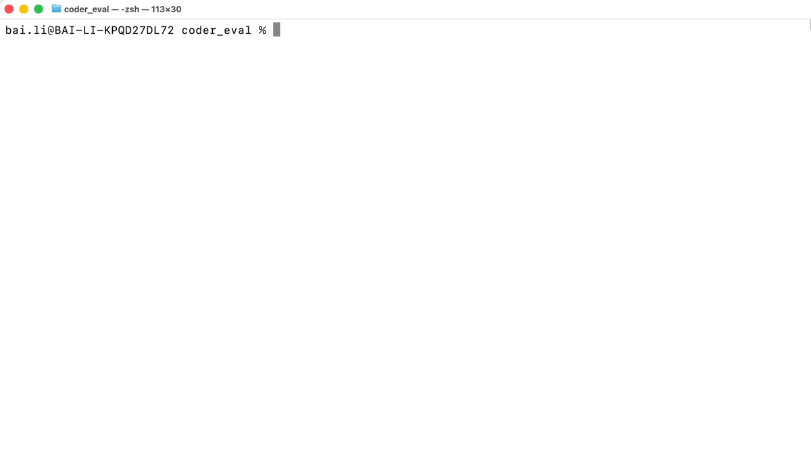

# coder_eval — evaluate AI coding agents & their skills

[](https://pypi.org/project/coder-eval/)
[](LICENSE)
[](https://www.python.org/downloads/)
[](https://github.com/limike954/agent-trajectory-data-00037/actions/workflows/pr-checks.yml)
[](https://github.com/astral-sh/ruff)

A framework for evaluating AI coding agents **and their skills** — built for CLI
and skill builders — with sandboxing, reproducibility, and data-driven analysis.
Not an "agentic coding" benchmark: it measures how effective your CLI and skills
are when used by coding agents.

<p align="center">
  
</p>

> **The Coding Agents Gym.** A sandboxed, reproducible framework to evaluate,
> benchmark, and A/B-test AI coding agents — Claude Code, Codex, and Google
> Antigravity (Gemini) today, any agent via a plugin SPI — with declarative
> YAML tasks and weighted scoring.

- **Declarative YAML tasks** with pinned dependencies and clear success criteria
- **Sandboxed execution** in isolated environments with resource limits
- **Weighted, continuous scoring** (0.0–1.0) with fractional credit and thresholds
- **Many criterion types** — from file checks to code similarity and LLM-graded rubrics
- **Agent abstraction** — Claude Code, Codex, and Antigravity (Gemini) today, extensible via a plugin SPI
- **Experiment layer** — A/B agent configs (models, tools, prompts) side-by-side
- **Full telemetry** — every tool call, token counts, and cost, with real-time streaming

## What you can do with it

- **Benchmark coding agents** — score an agent across a suite of tasks with weighted, pass/fail thresholds
- **Compare models & configs** — A/B-test Claude vs. Codex vs. Gemini, model vs. model, tool-on vs. tool-off, prompt vs. prompt
- **Evaluate skills** — verify an agent actually engages a target skill (`skill_triggered`) and score skill-driven suites (SkillsBench-style)
- **Keep skills up to date in CI** — re-validate your skills on every change or on a schedule; catch silent regressions when models, prompts, or the skills themselves drift
- **Gate CI on agent quality** — run the suite in GitHub Actions and fail the build on regressions
- **Bring your own dataset** — fan one task out over many rows for larger benchmark suites

> **Keeping skills fresh?** Run coder_eval as a scheduled GitHub Actions job so your
> skills are continuously re-evaluated against the latest model — a skill that quietly
> stops triggering surfaces as a failing criterion before your users hit it. See
> **[Tutorial 02 — Running coder_eval in CI](docs/tutorials/02-ci-pipeline.md)**.

## Quick Start

**Prerequisites:** Python 3.13+, [uv](https://docs.astral.sh/uv/) 0.8+, and the
[Claude CLI](https://docs.anthropic.com/claude/docs/claude-code) (`brew install claude`).
Developed on macOS; CI runs on Linux.

```bash
git clone https://github.com/limike954/agent-trajectory-data-00037.git
cd coder_eval

uv sync --extra dev          # install core + dev tools
cp .env.example .env         # then set ANTHROPIC_API_KEY

uv run coder-eval plan tasks/hello_date.yaml   # validate (no tokens spent)
uv run coder-eval run  tasks/hello_date.yaml   # run your first evaluation
uv run coder-eval report runs/latest           # view the result
```

New here? Follow **[Tutorial 01 — Your First Evaluation](docs/tutorials/01-first-evaluation.md)**.

The optional `[uipath]` extra (`uv sync --extra dev --extra uipath`) adds the in-host
`uipath` SDK for local sandbox parity; it installs from public PyPI (no credentials
required). Without it the framework runs end-to-end; uipath-dependent features fail
at dispatch with a clear hint.

> **Using coder_eval in CI or another project?** Install the published package:
> `pip install coder-eval` (or `uv add coder-eval`; extras install the same way —
> `pip install "coder-eval[codex,antigravity]"`). In a real CI gate, pin to a
> specific released version so a harness upgrade can't silently move your results.
> See [Tutorial 02 — Running coder_eval in CI](docs/tutorials/02-ci-pipeline.md) for the full setup.

## Telemetry

> 📊 **Usage telemetry is on by default.** `coder-eval` sends **anonymous** usage
> telemetry (command names, outcomes, counts, durations, an anonymous install id,
> platform info) to help improve the tool. It **never** captures prompts, file
> contents, or repo paths, and prints a one-time notice on first run. **To disable
> it, set `TELEMETRY_ENABLED=false`** in your `.env` or environment. See
> [Usage Telemetry](docs/USER_GUIDE.md#usage-telemetry) for details and how to route
> it to your own resource.

## Documentation

| Guide | What's in it |
| --- | --- |
| [Tutorials](docs/tutorials/README.md) | Step-by-step walkthroughs — start here |
| [User Guide](docs/USER_GUIDE.md) | Full CLI, configuration, output, and environment-variable reference |
| [Task Definition Guide](docs/TASK_DEFINITION_GUIDE.md) | The task-file schema — all criterion types, scoring, templates |
| [A/B Experiments](docs/AB_EXPERIMENTS.md) | Compare models / tools / prompts across the same tasks |
| [Bring Your Own Dataset](docs/BYOD.md) | Fan a single task out over a dataset |
| [Codex Agent Guide](docs/CODEX_AGENT_GUIDE.md) | Running the Codex agent |
| [Docker Isolation](docs/DOCKER_ISOLATION.md) | The container sandbox driver |
| [CLAUDE.md](CLAUDE.md) | Architecture, key patterns, and extension points |
| [CONTRIBUTING.md](CONTRIBUTING.md) | Dev setup, quality bar, and how to contribute |

## How it compares

- **vs. SWE-bench and fixed benchmarks** — SWE-bench is a fixed dataset of GitHub
  issues; coder_eval is a *framework* for authoring your own tasks in declarative
  YAML, so you evaluate the skills and workflows you care about (and can still wrap
  a fixed dataset via [Bring Your Own Dataset](docs/BYOD.md)).
- **vs. LLM-output eval harnesses (e.g. OpenAI Evals)** — those grade a model's text;
  coder_eval runs a full **agent** in a **sandbox** with real tool use and multi-turn
  dialog, then scores the files and commands it actually produced (continuous
  0.0–1.0) — not just a judge over a string.
- **vs. hand-rolled scripts** — reproducible sandboxes, weighted criteria,
  cost/token telemetry, A/B experiments, and CI-ready pass/fail gates out of the box.

## Task Definition

A task is a YAML file: a prompt, the agent config, a sandbox, and success criteria.

```yaml
task_id: "hello_world"
description: "Create a Python script that prints Hello, World!"
initial_prompt: "Create hello.py that prints 'Hello, World!'"

agent:
  type: "claude-code"
  permission_mode: "acceptEdits"
  allowed_tools: ["Read", "Write", "Bash"]

sandbox:
  driver: "tempdir"
  python: {}

success_criteria:
  - type: "file_exists"
    path: "hello.py"
    description: "hello.py must be created"
  - type: "run_command"
    command: "python hello.py"
    timeout: 10
    description: "Script must execute successfully"
```

Tasks can omit the `agent` section entirely — defaults resolve from the experiment
layer (`experiments/default.yaml`). For the full schema and every criterion type,
see the [Task Definition Guide](docs/TASK_DEFINITION_GUIDE.md).

> **Tip:** In Claude Code, use `/coder-eval-task-create` to scaffold a task from a
> natural-language description, and `/coder-eval-run-analysis runs/latest` to get
> improvement suggestions from a completed run.

## Development

```bash
make install    # package + dev + [uipath] deps + pre-commit hooks
make verify     # format + lint + typecheck + test + coverage (CI equivalent)
```

Run `make verify` before pushing — it mirrors CI (80% coverage threshold). See
[CONTRIBUTING.md](CONTRIBUTING.md) for the full workflow, commit conventions, and
extension points (new criteria, new agents).

## Known limits & non-goals

- **Not a fixed benchmark or leaderboard** — coder_eval scores *your* tasks and ships
  example tasks, not a canonical scored dataset.
- **Tasks execute real code** — run untrusted tasks only under the container driver
  (see [Docker Isolation](docs/DOCKER_ISOLATION.md)); the `tempdir` driver is not a
  security boundary.
- **Bring your own model credentials** — Anthropic, Bedrock, or Gemini keys; coder_eval
  does not proxy or supply model access.
- **Python 3.13+ only.**

## Support & security

- **Security vulnerabilities** — report privately via [SECURITY.md](SECURITY.md); never open a public issue.
- **Bugs & questions** — open a [GitHub issue](https://github.com/limike954/agent-trajectory-data-00037/issues).
- **Everything else** — reach the maintainers privately at **coder-eval@uipath.com**.

## License

© 2026 UiPath. Licensed under the Apache License, Version 2.0 — see
[LICENSE](LICENSE) and [NOTICE](NOTICE).

## Acknowledgments

Built with the [Claude Agent SDK](https://github.com/anthropics/claude-agent-sdk),
[Pydantic](https://pydantic.dev/), [Typer](https://typer.tiangolo.com/), and
[Rich](https://rich.readthedocs.io/).
